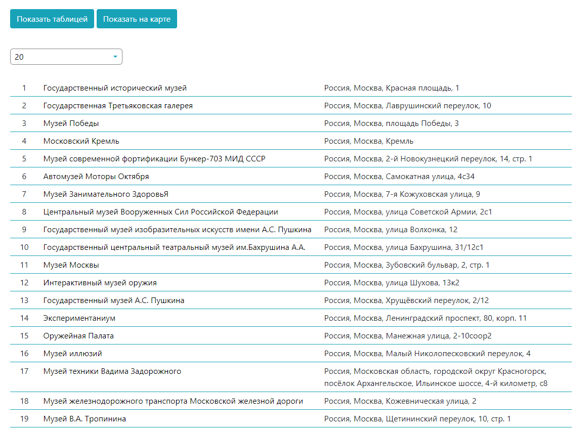
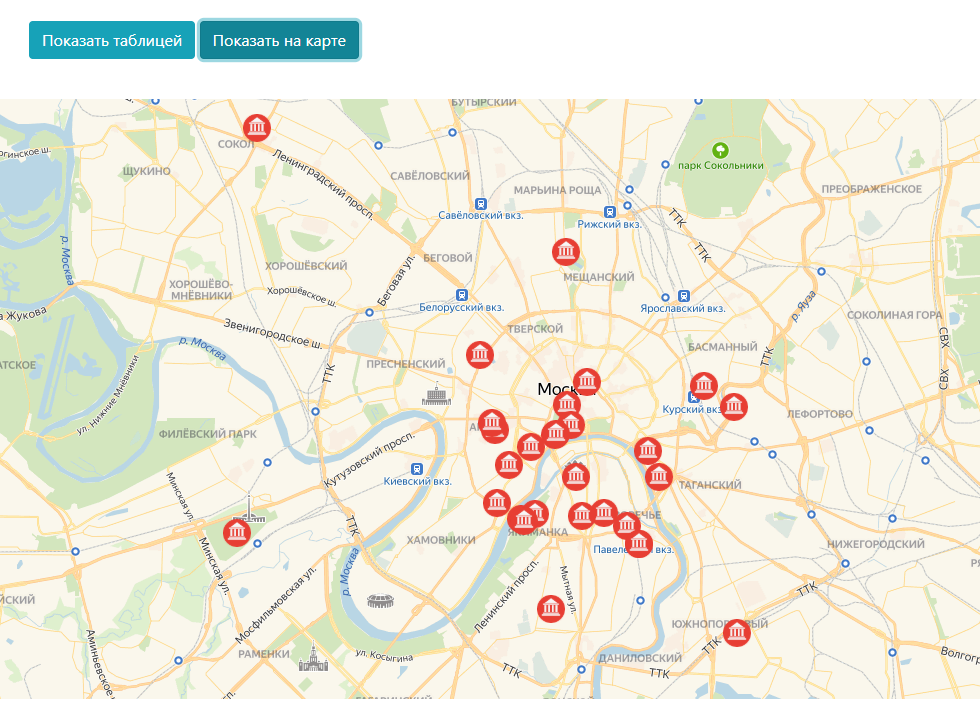

<h1>Тестовое задание для Royal Software</h1>

Для сборки выполнить:

npm i

npm run build

Далее открыть в браузере файл index.html в корне проекта

Внешний вид проекта, который должен получиться после сборки

Таблица

Карта

